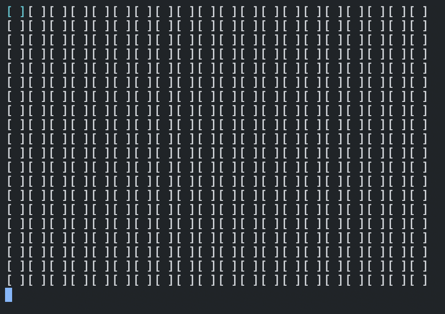
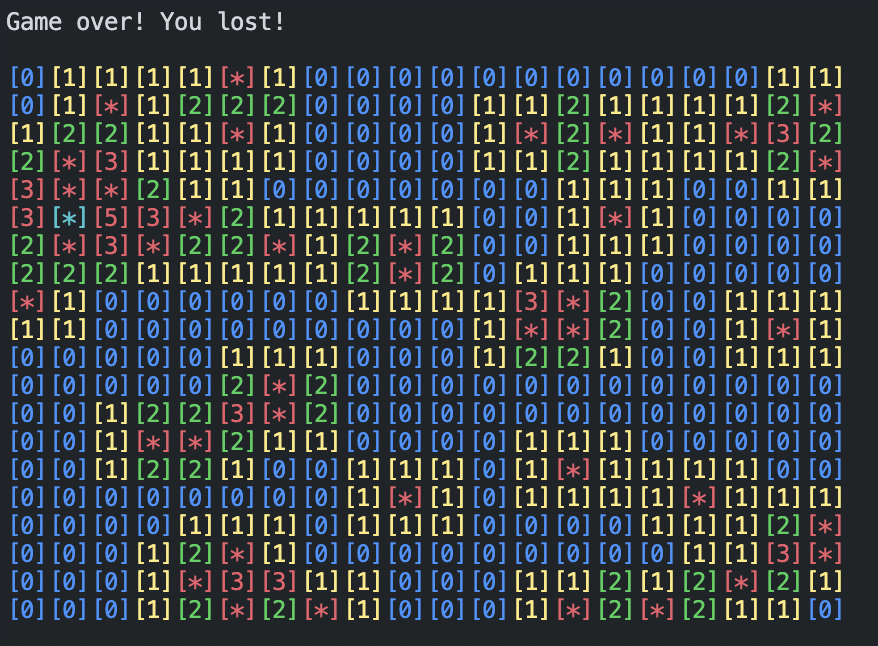

# Minesweeper

If you miss the old Minesweeper game, you've come to the right place. With this code you will be able to run the Minesweeper game in your terminal.

## How to start the game

In order to start the game you need to have installed Go programming language on your system.

1. clone this repository
2. go to directory where you cloned it
3. `cd cmd && go run .`

## How to play the game

When the game starts, you will be presented with this view in the terminal:

The blue tile is the selected tile. You can move around the minefield using arrow keys or w, a, s, d.

Press r on your keyboard to reveal a tile. Press f to flag a selected tile. And press e to unflag a tile.

Enjoy the game!

### Controls

- <kbd>&uarr;</kbd> or <kbd>W</kbd>- move up
- <kbd>&darr;</kbd> or <kbd>S</kbd>- move down
- <kbd>&larr;</kbd> or <kbd>A</kbd>- move left
- <kbd>&rarr;</kbd> or <kbd>D</kbd>- move right
- <kbd>R</kbd> - reveal selected tile
- <kbd>F</kbd> - flag selected tile
- <kbd>E</kbd> or <kbd>U</kbd> - unflag selected tile
